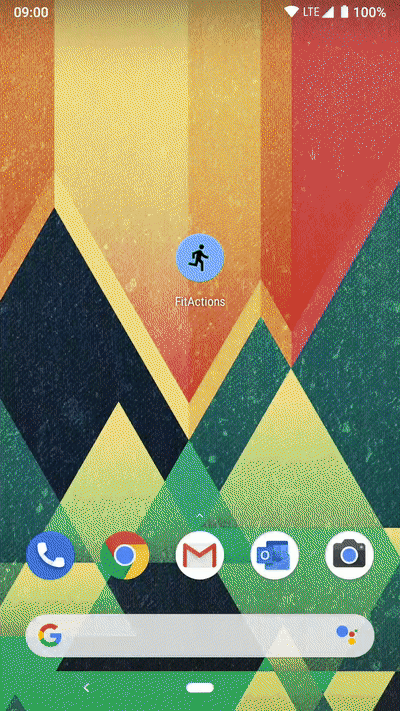

### Final Report：https://docs.google.com/document/d/1LQUoRTgaxzItHDhOkvSWNu8GMxXyyPEYnZtxNuZM8M4/edit?usp=sharing
### Test Vedio(running count): https://drive.google.com/file/d/1AoNmHiE4iIVtYL6YooUAbnCUf8uJiwW8/view?usp=sharing
This is the EEP523 final project, a Fitness application that allows displaying workout information as well as starting and stopping a workout. 
## APIs Use:
By implementing [App Actions](https://developer.android.com/guide/app-actions/overview), we enable users to call upon our application to fulfill supported [built-in intents (BIIs)](https://developer.android.com/reference/app-actions/built-in-intents) in the fitness category.

Specifically, this project supports the following BIIs:
* `actions.intent.START_EXERCISE`: Opens the app and starts an exercise session.
* `actions.intent.STOP_EXERCISE`: Opens the app and stops the current exercise session.
* `actions.intent.GET_EXERCISE_OBSERVATION`: Displays a [widget](https://developers.google.com/assistant/app/widgets) inside the Assistant with information on a particular exercise statistic.


## Sensor Use: 
Step Count sensor

## How to use this project

Clone or download the project to your preferred location. Then, import and modify the project with the following steps:

1. In Android Studio, select **Open an existing Android Studio project** from the initial screen, or go to **File > Open**.
2. Change the `applicationId` in [app/build.gradle](app/build.gradle) to the `applicationId` of one of your draft or published apps in the Google Play Console.

    ```groovy
    android {
        defaultConfig {
            // This ID uniquely identifies your app on the device and in Google Play
            applicationId "PUT_YOUR_APPLICATION_ID_HERE"
        }
    }
    ```

3. Change the three (3) `android:targetPackage` in [app/src/main/res/xml/shortcuts.xml](app/src/main/res/xml/shortcuts.xml) to the `applicationId` in your [app/build.gradle](app/build.gradle).

    ```xml
    <capability android:name="actions.intent.START_EXERCISE">
        <intent
            android:targetPackage="PUT_YOUR_APPLICATION_ID_HERE">
        </intent>
    </capability>
    ```

    ```xml
    <capability android:name="actions.intent.STOP_EXERCISE">
        <intent
            android:targetPackage="PUT_YOUR_APPLICATION_ID_HERE">
        </intent>
    </capability>
    ```

    ```xml
    <capability android:name="actions.intent.GET_EXERCISE_OBSERVATION">
        <intent
            android:targetPackage="PUT_YOUR_APPLICATION_ID_HERE">
        </intent>
    </capability>
    ```

4. In Android Studio, find the root directory of the project.
5. Select the `build.gradle` file.
6. Follow the instructions presented by the IDE.
7. Install [Google Assistant plugin for Android Studio](https://developers.google.com/assistant/app/test-tool).

Then, you can try the App Actions by following these steps:

1. Build and run the project on your physical test device (**Run "app"**).
2. Open the App Actions test tool (**Tools > Google Assistant > App Actions Test Tool**).
3. Define an invocation name to use for invoking the App Actions (like "my test app"). This name is only for testing purposes, so it can be different from what you want to deploy to production later.
4. Click **Create Preview**. Once your preview is created, the test tool window updates to display information about BIIs found in your `shortcuts.xml` file.

After you create a preview, you can then try using voice or written commands directly with Assistant on your test device.

If you run into any issues, check out the [troubleshooting guide](https://developers.google.com/assistant/app/troubleshoot) in our developer documentation.


## References

* [App Actions Overview](https://developers.google.com/assistant/app/overview)
* [Built-in Intents reference](https://developers.google.com/assistant/app/reference/built-in-intents/bii-index)
* [App Actions Test Tool](https://developers.google.com/assistant/app/test-tool)
* [Codelab](https://developers.google.com/assistant/app/codelabs)
* [Other samples](https://developers.google.com/assistant/app/samples)

## License
```
Copyright 2019 Google LLC

Licensed under the Apache License, Version 2.0 (the "License");
you may not use this file except in compliance with the License.
You may obtain a copy of the License at

   https://www.apache.org/licenses/LICENSE-2.0

Unless required by applicable law or agreed to in writing, software
distributed under the License is distributed on an "AS IS" BASIS,
WITHOUT WARRANTIES OR CONDITIONS OF ANY KIND, either express or implied.
See the License for the specific language governing permissions and
limitations under the License.
```
